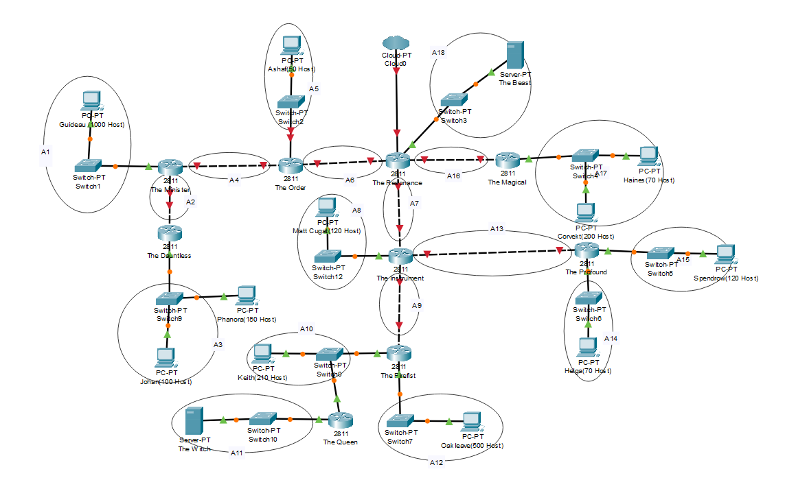
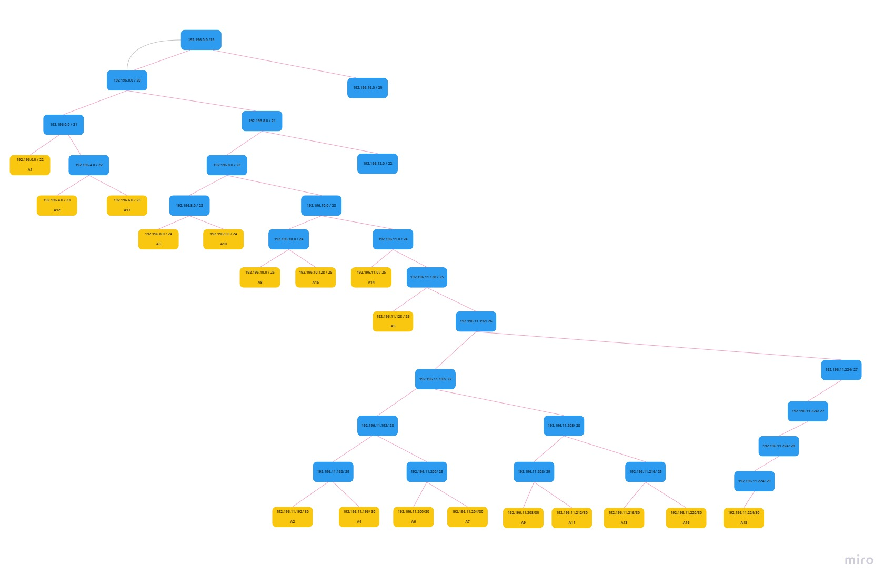
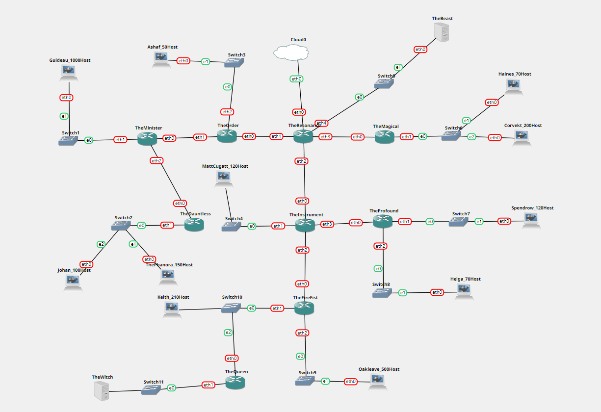
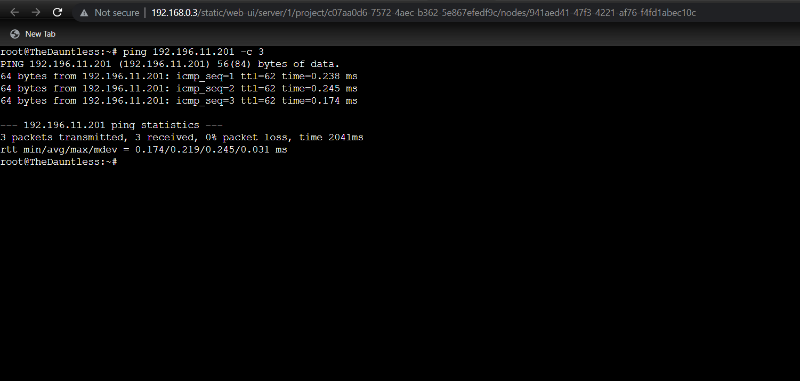

# Jarkom-Modul-4-E08-2022
Laporan Resmi Praktikum I Jaringan Komputer oleh Kelompok E08

### Kelompok E08

| **No** | **Nama** | **NRP** |
| - | - | - |
| 1. | Halyusa Ard Wahyudi | 5025201088 |
| 2. | Muhammad Ismail | 5025201223 |
| 3. | Immanuel Maruli Tua Pardede | 5025201166 |

## Soal
Deadline hari Rabu, 23 November pukul 22.00

Soal shift dikerjakan pada Cisco Packet Tracer dan GNS3 menggunakan metode perhitungan CLASSLESS yang berbeda.

Keterangan: Bila di CPT menggunakan VLSM, maka di GNS3 menggunakan CIDR atau Sebaliknya

Jika tidak ada pemberitahuan revisi soal dari asisten, berarti semua soal BERSIFAT BENAR dan DAPAT DIKERJAKAN.

Untuk di GNS3 CLOUD merupakan NAT1 jangan sampai salah agar bisa terkoneksi internet.

Pembagian IP menggunakan Prefix IP yang telah ditentukan pada modul pengenalan

Pembagian IP dan routing harus SE-EFISIEN MUNGKIN.

## Jawaban


## Topologi CPT


### VLSM


## Topologi GNS3


**Konfigurasi Resonance**
```text
auto eth0
iface eth0 inet dhcp

auto eth1
iface eth1 inet static
      address 192.196.11.201
      netmask 255.255.255.252

auto eth2
iface eth2 inet static
      address 192.196.11.205
      netmask 255.255.255.252

auto eth3
iface eth3 inet static
      address 192.196.11.221
      netmask 255.255.255.252

auto eth4
iface eth4 inet static
      address 192.196.11.225
      netmask 255.255.255.252
```

**Konfigurasi The Order**
```text
auto eth0
iface eth0 inet static
      address 192.196.11.202
      netmask 255.255.255.252
      gateway 192.196.11.201

auto eth1
iface eth1 inet static
      address 192.196.11.197
      netmask 255.255.255.252

auto eth2
iface eth2 inet static
      address 192.196.11.129
      netmask 255.255.255.192

```

**Konfigurasi The Minister**
```text
auto eth0
iface eth0 inet static
      address 192.196.11.198
      netmask 255.255.255.252
      gateway 192.196.11.197

auto eth1
iface eth1 inet static
      address 192.196.0.1
      netmask 255.255.252.0

auto eth2
iface eth2 inet static
      address 192.196.11.193
      netmask 255.255.255.252
```

**Konfigurasi The Dauntless**
```text
auto eth0
iface eth0 inet static
      address 192.196.11.194
      netmask 255.255.255.252
      gateway 192.196.11.193

auto eth1
iface eth1 inet static
      address 192.196.8.1
      netmask 255.255.255.0
```
**Konfigurasi The Instrument**
```text
auto eth0
iface eth0 inet static
      address 192.196.11.206
      netmask 255.255.255.252
      getaway 192.196.11.205

auto eth1
iface eth1 inet static
      address 192.196.10.1
      netmask 255.255.255.128

auto eth2
iface eth2 inet static
      address 192.196.11.209
      netmask 255.255.255.252

auto eth3
iface eth3 inet static
      address 192.196.11.217
      netmask 255.255.255.252
```

**Konfigurasi The Profound**
```text
auto eth0
iface eth0 inet static
      address 192.196.11.218
      netmask 255.255.255.252
      gateway 192.196.11.217

auto eth1
iface eth1 inet static
      address 192.196.10.129
      netmask 255.255.255.128

auto eth2
iface eth2 inet static
      address 192.196.11.1
      netmask 255.255.255.128
```

**Konfigurasi The Firefist**
```text
auto eth0
iface eth0 inet static
      address 192.196.11.210
      netmask 255.255.255.252
      gateway 192.196.11.209

auto eth1
iface eth1 inet static
      address 192.196.9.1
      netmask 255.255.255.0

auto eth2
iface eth2 inet static
      address 192.196.4.1
      netmask 255.255.254.0
```

**Konfigurasi The Queen**
```text
auto eth0
iface eth0 inet static
      address 192.196.9.2
      netmask 255.255.255.0
      gateway 192.196.9.1

auto eth1
iface eth1 inet static
      address 192.196.11.213
      netmask 255.255.255.252
```

**Konfigurasi The Magical**
```text
auto eth0
iface eth0 inet static
      address 192.196.11.222
      netmask 255.255.255.252
      gateway 192.196.11.221

auto eth1
iface eth1 inet static
      address 192.196.6.1
      netmask 255.255.254.0
```

### CIDR Routing - Setting Host Configuration

**Konfigurasi: Guideau (1000 Host)**
```text
auto eth0
iface eth0 inet static
      address 192.196.0.2
      netmask 255.255.252.0
      gateway 192.196.0.1
```

**Konfigurasi: Phanora (150 Host)**
```text
auto eth0
iface eth0 inet static
      address 192.196.8.2
      netmask 255.255.255.0
      gateway 192.196.8.1
```

**Konfigurasi: Johan (100 Host)**
```text
auto eth0
iface eth0 inet static
      address 192.196.8.3
      netmask 255.255.255.0
      gateway 192.189.0.1
```

**Konfigurasi: Ashaf (50 Host)**
```text
auto eth0
iface eth0 inet static
      address 192.196.11.130
      netmask 255.255.255.192
      gateway 192.196.11.129
```

**Konfigurasi: Matt Cugatt (120 Host)**
```text
auto eth0
iface eth0 inet static
      address 192.196.10.2
      netmask 255.255.255.128
      gateway 192.196.10.1
```

**Konfigurasi: Keith (210 Host)**
```text
auto eth0
iface eth0 inet static
      address 192.196.9.2
      netmask 255.255.255.0
      gateway 192.196.9.1
```

**Konfigurasi: Oakleave (500 Host)**
```text
auto eth0
iface eth0 inet static
      address 192.196.4.2
      netmask 255.255.254.0
      gateway 192.196.4.1
```

**Konfigurasi: The Witch (Server)**
```text
auto eth0
iface eth0 inet static
      address 192.196.11.214
      netmask 255.255.255.252
      gateway 192.196.11.213
```

**Konfigurasi: The Beast (Server)**
```text
auto eth0
iface eth0 inet static
      address 192.196.11.226
      netmask 255.255.255.252
      gateway 192.196.11.225
```

**Konfigurasi: Haines (70 Host)**
```text
auto eth0
iface eth0 inet static
      address 192.196.6.2
      netmask 255.255.254.0
      gateway 192.196.6.1
```

**Konfigurasi: Corvekt (200 Host)**
```text
auto eth0
iface eth0 inet static
      address 192.196.6.3
      netmask 255.255.254.0
      gateway 192.196.6.1
```

**Konfigurasi: Spendrow (120 Host)**
```text
auto eth0
iface eth0 inet static
      address 192.196.10.130
      netmask 255.255.255.128
      gateway 192.196.10.129
```

**Konfigurasi: Helga (70 Host)**

```text
auto eth0
iface eth0 inet static
      address 192.196.11.2
      netmask 255.255.255.128
      gateway 192.196.11.1
```

### CIDR Routing - Routing
Buat semacam script pada setiap router untuk menyimpan routing
**The Resonance**
```text
iptables -t nat -A POSTROUTING -o eth0 -j MASQUERADE -s 192.196.0.0/15
route add -net 192.196.4.0 netmask 255.255.252.0 gw 192.196.11.202       
route add -net 192.196.11.196 netmask 255.255.255.252 gw 192.196.11.202  
route add -net 192.196.11.192 netmask 255.255.255.252 gw 192.196.11.202  
route add -net 192.196.8.0 netmask 255.255.255.0 gw 192.196.11.202       
route add -net 192.196.11.128 netmask 255.255.255.192 gw 192.196.11.202  
route add -net 192.196.11.212 netmask 255.255.255.252 gw 192.196.11.206  
route add -net 192.196.4.0 netmask 255.255.254.0 gw 192.196.11.206       
route add -net 192.196.9.0 netmask 255.255.255.0 gw 192.196.11.206      
route add -net 192.196.11.0 netmask 255.255.255.128 gw 192.196.11.206   
route add -net 192.196.10.128 netmask 255.255.255.128 gw 192.196.11.206    
route add -net 192.196.11.216 netmask 255.255.255.252 gw 192.196.11.206    
route add -net 192.196.10.0 netmask 255.255.255.128 gw 192.196.11.206    
```

**The Order**
```text
echo nameserver 192.168.122.1 > /etc/resolv.conf
route add -net 192.196.0.0 netmask 255.255.252.0 gw 192.196.11.198        
route add -net 192.196.8.0 netmask 255.255.255.0 gw 192.196.11.198        
route add -net 192.196.11.192 netmask 255.255.255.252 gw 192.196.11.198   
route add -net 0.0.0.0 netmask 0.0.0.0 gw 192.196.11.198  
```

**The Minister**
```text
echo nameserver 192.168.122.1 > /etc/resolv.conf
route add -net 192.196.8.0 netmask 255.255.255.0 gw 192.196.11.193         
route add -net 0.0.0.0 netmask 0.0.0.0 gw 192.196.11.197
```

**The Dauntless**
```text
echo nameserver 192.168.122.1 > /etc/resolv.conf
route add -net 0.0.0.0 netmask 0.0.0.0 gw 192.196.11.193
```

**The Magical**
```text
echo nameserver 192.168.122.1 > /etc/resolv.conf
route add -net 0.0.0.0 netmask 0.0.0.0 gw 192.196.11.221
```

**The Instrument**
```text
echo nameserver 192.168.122.1 > /etc/resolv.conf
route add -net 192.196.11.212 netmask 255.255.255.252 gw 192.196.11.209
route add -net 192.196.4.0 netmask 255.255.254.0 gw 192.196.11.209     
route add -net 192.196.9.0 netmask 255.255.255.0 gw 192.196.11.209     
route add -net 192.196.11.0 netmask 255.255.255.128 gw 192.196.11.217 
route add -net 192.196.10.128 netmask 255.255.255.128 gw 192.196.11.217
route add -net 0.0.0.0 netmask 0.0.0.0 gw 192.196.11.205
```

**The Profound**
```text
echo nameserver 192.168.122.1 > /etc/resolv.conf
route add -net 0.0.0.0 netmask 0.0.0.0 gw 192.196.11.217
```

**The Firefist**
```text
echo nameserver 192.168.122.1 > /etc/resolv.conf
route add -net 192.196.11.212 netmask 255.255.255.252 gw 192.196.9.1 
route add -net 0.0.0.0 netmask 0.0.0.0 gw 192.196.11.210
```

**The Queen**
```text
echo nameserver 192.168.122.1 > /etc/resolv.conf
route add -net 0.0.0.0 netmask 0.0.0.0 gw 192.196.9.2
```

### CIDR Routing - IP Tables The Resonance
Pada router **The Resonance** jalankan perintah berikut ini:
```text
  iptables -t nat -A POSTROUTING -o eth0 -j MASQUERADE -s 192.196.0.0/15
```
### CIDR Routing - Setting resolv.conf
Pada semua node selain **The Resonance** (termasuk router-router lain), jalankan perintah berikut ini:
```text
  echo nameserver 192.168.122.1 > /etc/resolv.conf
```

### CIDR Routing - Bukti Berhasil Ping
